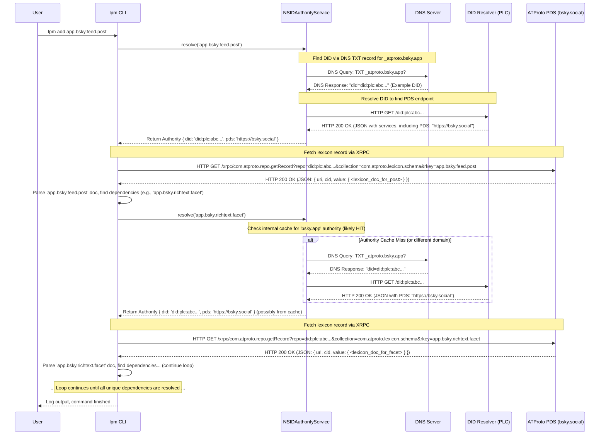

# Walkthrough: `lpm add app.bsky.feed.post` Network Requests

This document outlines the sequence of network requests made when you run the command `lpm add app.bsky.feed.post`.

The process primarily involves two stages for *each* unique NSID that needs to be resolved (starting with `app.bsky.feed.post` and then its dependencies):

1.  **Authority Resolution:** Finding out *which* server (PDS) and user account (DID) is authoritative for the NSID.
2.  **Lexicon Fetching:** Requesting the actual lexicon document from the authoritative PDS.

## Sequence Diagram

## Explanation of Network Steps

**Assumptions:**

*   The NSID `app.bsky.feed.post` is managed under the domain `bsky.app`.
*   The authority for `bsky.app` uses a `did:plc` identifier (e.g., `did:plc:abc...`).
*   We are starting with no caches populated.

1.  **Authority Resolution (`app.bsky.feed.post`):**
    *   **DNS Lookup (Non-HTTP):** The `NSIDAuthorityService` first needs to find the DID associated with the domain part (`bsky.app`). It constructs a specific domain (`_atproto.bsky.app`) and performs a **DNS TXT record query**. This is typically UDP or TCP traffic to a DNS resolver, not HTTP.
        *   *Request:* Query for TXT records at `_atproto.bsky.app`.
        *   *Response:* A TXT record containing the DID, e.g., `"did=did:plc:abc..."`.
    *   **DID Resolution (HTTP):** Once the DID (`did:plc:abc...`) is known, the service needs to resolve it to find the associated service endpoints, specifically the PDS. For `did:plc`, this usually involves an **HTTP GET request** to a PLC directory/resolver.
        *   *Request:* `GET https://plc.directory/did:plc:abc...` (or similar PLC resolver URL)
        *   *Response (Success):* `200 OK` with a JSON body (the DID Document) containing a `service` array. One of the services will have the ID `#atproto_pds` and specify the `serviceEndpoint`, e.g., `https://bsky.social`.
        *   *Response (Failure):* `404 Not Found` if the DID doesn't exist, etc.

2.  **Lexicon Fetching (`app.bsky.feed.post`):**
    *   **XRPC Call (HTTP):** The `lpm CLI` (specifically the code within `Schema.#internalResolve`) now knows the PDS (`https://bsky.social`) and the DID (`did:plc:abc...`). It makes an **HTTP GET request** to the standard AT Protocol `com.atproto.repo.getRecord` XRPC endpoint on that PDS.
        *   *Request:*
            *   Method: `GET`
            *   URL: `https://bsky.social/xrpc/com.atproto.repo.getRecord`
            *   Query Parameters:
                *   `repo=did:plc:abc...` (The DID owning the record)
                *   `collection=com.atproto.lexicon.schema` (The collection for lexicon schemas)
                *   `rkey=app.bsky.feed.post` (The specific lexicon NSID)
            *   Headers: `Accept: application/json`, potentially others.
        *   *Response (Success):* `200 OK` with `Content-Type: application/json`. The body contains the record details, including the lexicon document itself under the `value` key: `{ "uri": "...", "cid": "...", "value": { "lexicon": 1, "id": "app.bsky.feed.post", ... } }`.
        *   *Response (Failure):* `404 Not Found` if the record doesn't exist on that repo, `400 Bad Request` for invalid parameters, etc.

3.  **Dependency Loop:**
    *   The CLI parses the fetched `app.bsky.feed.post` document and finds references to other lexicons (e.g., `app.bsky.richtext.facet`).
    *   For each *new* dependency NSID found:
        *   **Authority Resolution:** The process repeats (Steps 1a & 1b). However, the `NSIDAuthorityService` might have internal caching. Since `app.bsky.richtext.facet` is also likely under `bsky.app`, the service might hit its cache and immediately know the authority is still `did:plc:abc...` / `https://bsky.social`, potentially skipping the DNS and DID HTTP calls for this dependency.
        *   **Lexicon Fetching:** A new XRPC **HTTP GET request** (Step 2) is made to fetch the dependency's lexicon document (e.g., `...&rkey=app.bsky.richtext.facet`).
    *   This continues until all unique lexicons in the dependency graph have been fetched.

## Summary of HTTP Requests per NSID (Worst Case - No Caching):

*   **1 HTTP GET** to a DID Resolver (e.g., PLC Directory).
*   **1 HTTP GET** to the authoritative ATProto PDS (XRPC `getRecord`).

DNS lookups also occur but are not HTTP. Caching at the DNS level, DID resolver level, or within the `NSIDAuthorityService` can reduce these requests significantly for subsequent lookups within the same domain or for the same DID.
